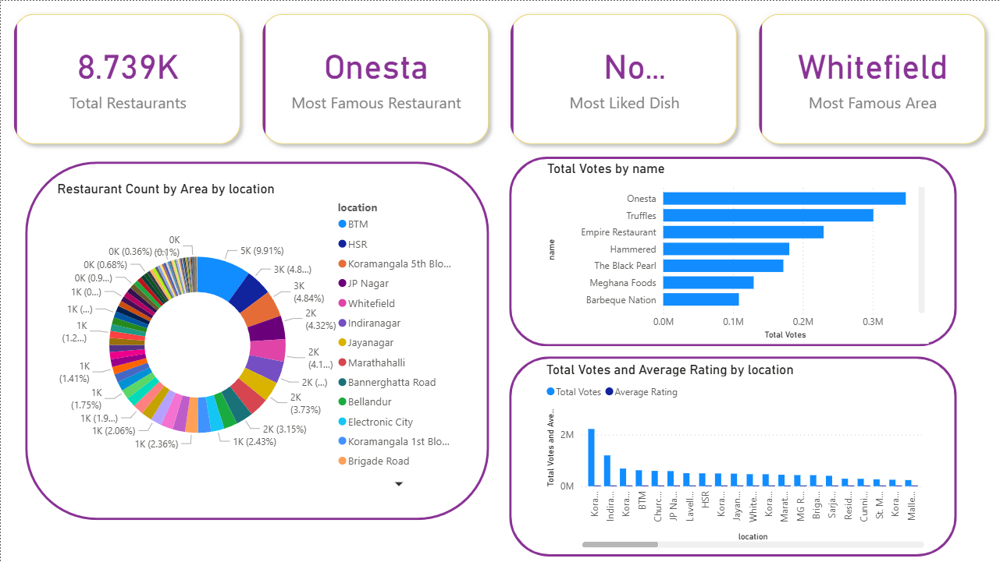

# Zomato Restaurant Data Engineering Pipeline | Power BI Analytics

This project demonstrates an end-to-end **Data Engineering pipeline** built using a real-world Zomato restaurant dataset.  
The pipeline covers **data ingestion, cleaning, data warehousing, dimensional modeling, and dashboard reporting** for business insights.

---
## 📊 Power BI Dashboard Preview

Below is the dashboard built as the final reporting layer of the data engineering pipeline:

---

## 🎯 Project Objectives

- Collect and preprocess restaurant data
- Design a **dimensional data model** suitable for analytics
- Load clean data into a **PostgreSQL Data Warehouse**
- Create automated data refresh pipelines
- Build a Power BI dashboard for insights

---

## 🏗️ Architecture

Raw CSV → Python (Pandas) → Cleaned Data → PostgreSQL (Data Warehouse) → Power BI Dashboard
---

## 🧱 Tech Stack

| Layer | Technology |
|------|------------|
| Data Storage | CSV / Kaggle dataset |
| Data Transformation | Python (Pandas) |
| Data Warehouse | PostgreSQL |
| Data Modeling | Star Schema (Fact & Dimensions) |
| Analytics & Visualization | Power BI |
| Version Control | Git & GitHub |

---

## 🗄️ Data Model (Star Schema)

### Fact Table
- **fact_restaurant_insights**
  - restaurant_id (FK)
  - location_id (FK)
  - cuisine_id (FK)
  - approx_cost
  - rating
  - votes

### Dimension Tables
| Dimension | Attributes |
|----------|-----------|
| dim_restaurant | restaurant_id, name, rest_type |
| dim_location | location_id, location, city |
| dim_cuisine | cuisine_id, cuisines |

